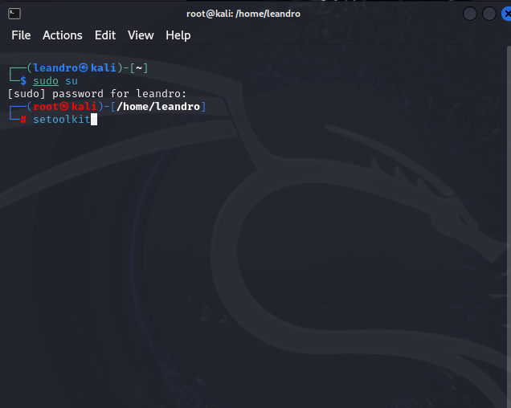
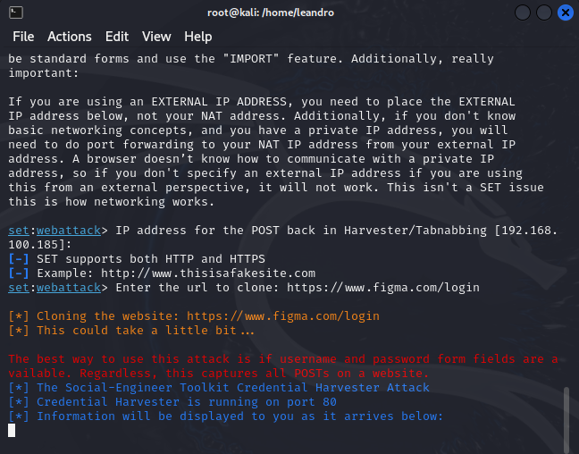
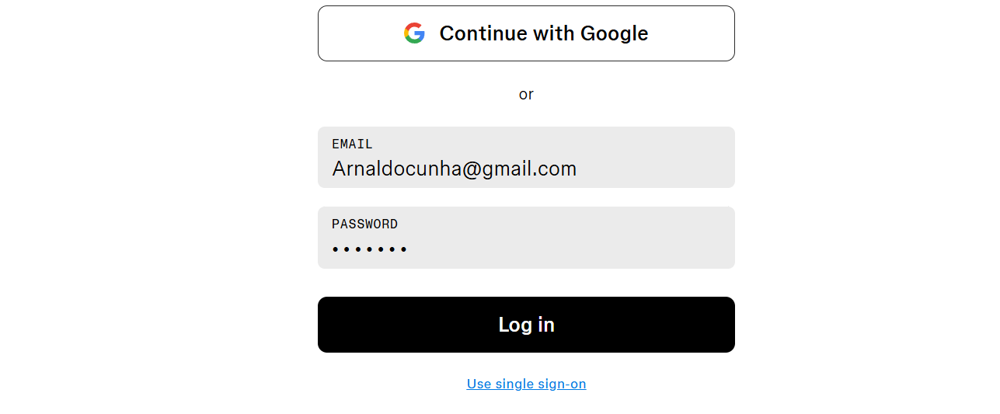
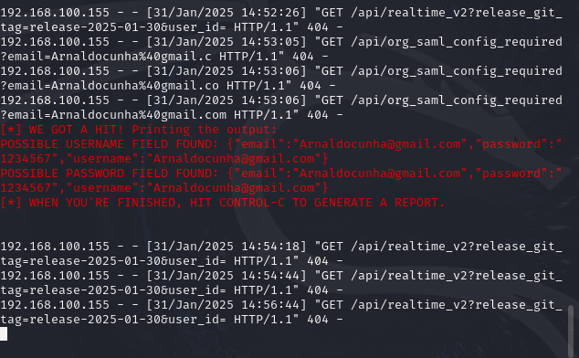

# Phishing para captura de senhas de Sites

### Ferramentas

- Kali Linux
- setoolkit

### Configurando o Phishing no Kali Linux

- Acesso root: ``` sudo su ```
- Iniciando o setoolkit: ``` setoolkit ```



- Tipo de ataque: ```[1] Social-Engineering Attacks ```
- Vetor de ataque: ```[2] Web Site Attack Vectors ```
- Método de ataque: ```[3] Credential Harvester Attack Method ```
- Método de ataque: ```[2] Site Cloner ```
- Obtendo o endereço da máquina: ``` Aperte enter ou digite ifconfig ```
- URL para clone: https://www.figma.com/login ou qualquer outro site


-Entre no navegador usando o IP informado!

### Resutados




